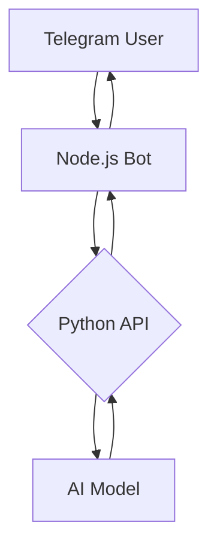

# Telegram AI Chat Bot 🤖

A dual-stack AI chatbot integration featuring:
- Python FastAPI backend for AI processing
- Node.js Telegram bot interface
- GPT-4o-mini model integration
- Persian language support

## Features ✨
- Telegram group chat integration
- AI responses to mentions/replies
- Conversation history management
- Cross-platform compatibility
- Error handling and logging
- Configurable AI parameters

## Prerequisites 📋
- Python 3.9+
- Node.js 16+
- npm
- Telegram bot token (@BotFather)
- API authorization token

## Project Structure 📂
```
.
├── ai-api.py          # Python FastAPI backend
├── bot.js             # Node.js Telegram bot
├── requirements.txt   # Python dependencies
├── package.json       # Node.js dependencies (create with npm init)
└── data.json          # Conversation history (auto-generated)
```

## Setup & Installation ⚙️

### 1. Python Backend Setup
```bash
# Create virtual environment
python -m venv venv
source venv/bin/activate  # Linux/Mac
# venv\Scripts\activate  # Windows

# Install dependencies
pip install -r requirements.txt

```

### 2. Node.js Bot Setup
```bash
# Install dependencies
npm install
OR
npm install telegraf fastify @fastify/cors

# Configure bot token
export BOT_TOKEN="your_telegram_bot_token"
# Or set directly in bot.js:
# const BOT_TOKEN = 'your_actual_token_here';
```

## Running the System 🚀

### Start Python Backend
```bash
python ai-api.py
```

### Start Telegram Bot
```bash
node bot.js
```

Keep both terminals running simultaneously.

## Configuration ⚙️
### Environment Variables
```ini
# .env
TELEGRAM_BOT_TOKEN=your_bot_token_here
API_AUTH_TOKEN=sk-1234567890abcdef
API_URL=http://localhost:11434/v1/chat/completions
```

## Usage Examples 💬
1. **In Telegram Group**:
   - Mention the bot: "@yourbotname سلام چطوری?"
   - Reply to bot's message with your question
   - Reset history: "فراموش کن"

2. **API Endpoint**:
```bash
curl -X POST "http://localhost:11434/v1/chat/completions" \
-H "Authorization: Bearer sk-1234567890abcdef" \
-H "Content-Type: application/json" \
-d '{
  "model": "gpt-4o-mini",
  "messages": [{"role": "user", "content": "سلام"}],
  "max_tokens": 100,
  "temperature": 0.7
}'
```

## System Architecture 🏗️


## Key Features 🔑
- **Natural Conversations**: Context-aware responses
- **Multi-Platform**: Web API + Telegram integration
- **Security**: Token-based authentication
- **Persistence**: Stores last 10 conversations
- **Error Handling**: Graceful failure recovery

## Troubleshooting 🛠️
- Ensure ports 11434 (Python) and 8787 (Node) are available
- Verify API tokens in both services match
- Check console logs for both processes
- Test API directly before testing Telegram integration

## License 📄
MIT License - Free for personal and commercial use 
